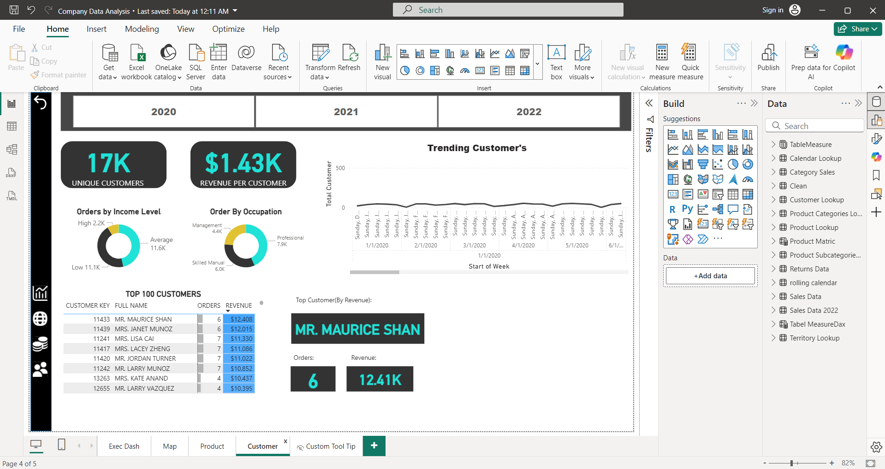
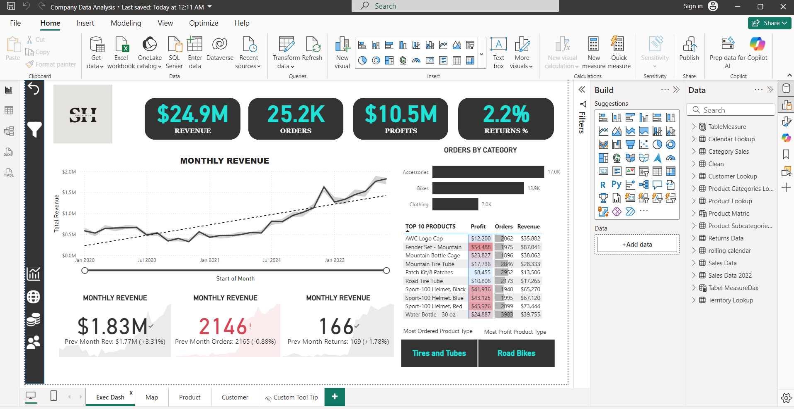
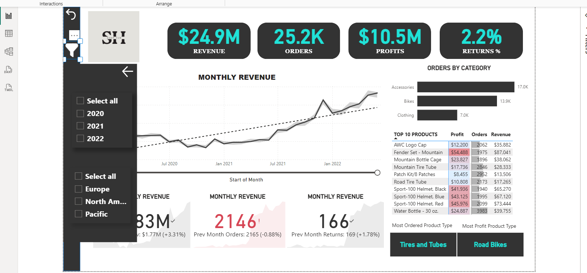
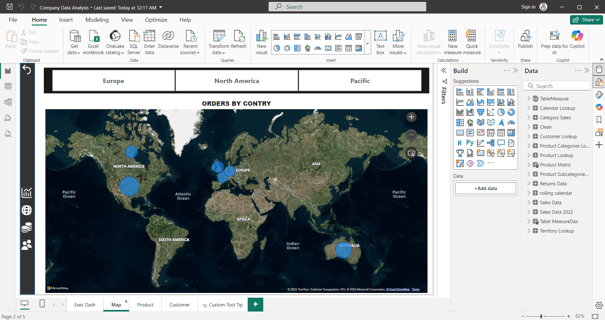
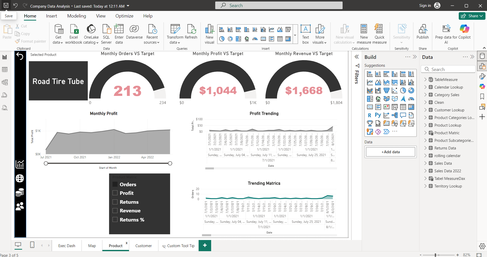

# 📊 Company Data Analysis - Power BI Project

This project is a comprehensive **company data analysis dashboard** created using **Microsoft Power BI Desktop**. It provides visual insights into key business metrics to support data-driven decision-making.

---

## 🧩 Features

- 📈 **Sales and Revenue Analysis**  
  Visualizes total revenue, sales trends, and product-wise performance.

- 🌍 **Geographical Insights**  
  Interactive map visualizations of sales by region or country.

- 🧑‍🤝‍🧑 **Customer Segmentation**  
  Breakdown by customer type, age groups, or purchase behavior.

- ⏳ **Time-Based Analysis**  
  Year-over-year or month-over-month performance trends.

- 🧹 **Interactive Filters & Slicers**  
  Easily slice data by category, region, product line, and time.

---

## 🗃️ Dataset

- This report uses fictional **company data** for analysis purposes.
- Data fields may include: `Date`, `Product`, `Region`, `Sales`, `Profit`, `Customer Type`, and more.

---

## 🛠️ Tools Used

- **Microsoft Power BI Desktop**
- Data modeling using Power Query and DAX

---

## 📁 File

- `Company Data Analysis.pbix` – the Power BI report file.  
  👉 You can download and open it using [Power BI Desktop] 

---

## 📸 Preview

> ### 👥 Customer View

### 🧑‍💼 Executive Dashboard

### 🎛️ Filter Panel

### 🗺️ Regional Map

### 📦 Product Overview

---

## 📌 Notes

- This report is created for learning and showcasing Power BI skills.
- No confidential or real company data has been used.

---

## 📬 Contact

For any questions or suggestions:  
**Charan Reddy** – [LinkedIn](https://www.linkedin.com/in/sri-charan-reddy-katterapu-6902b9263/) • [Email](sricharanreddykatterapu@gmail.com)
